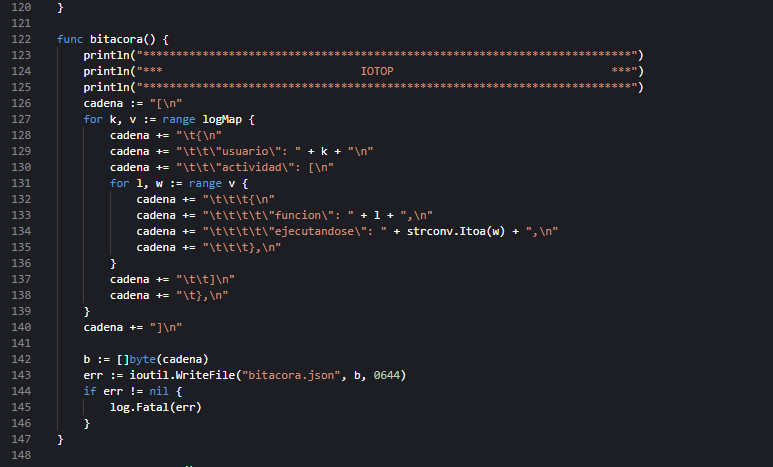
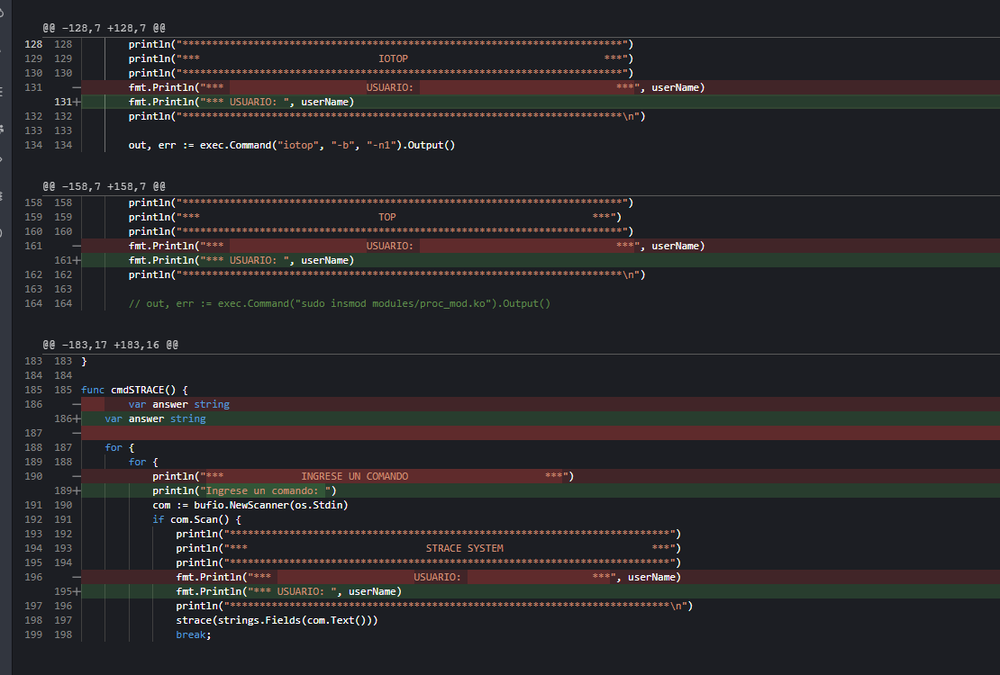
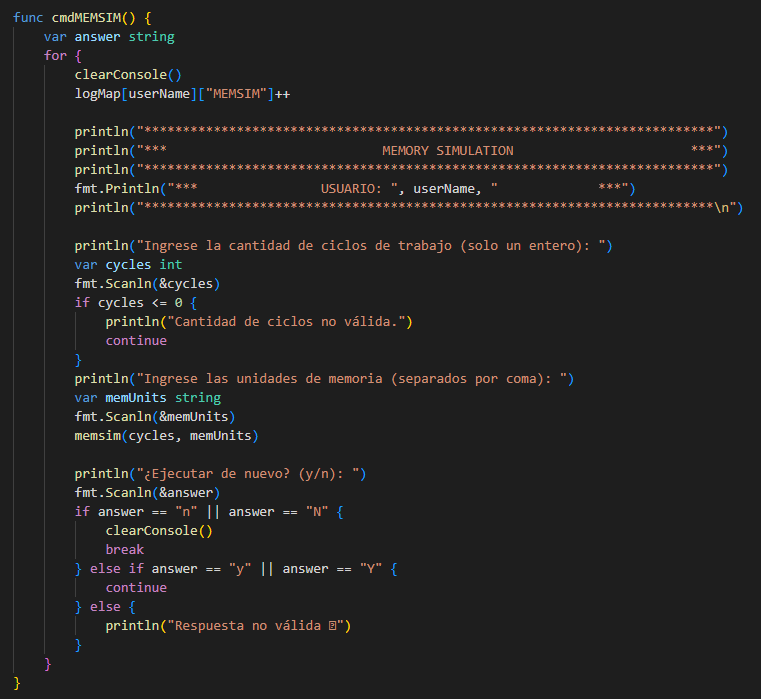
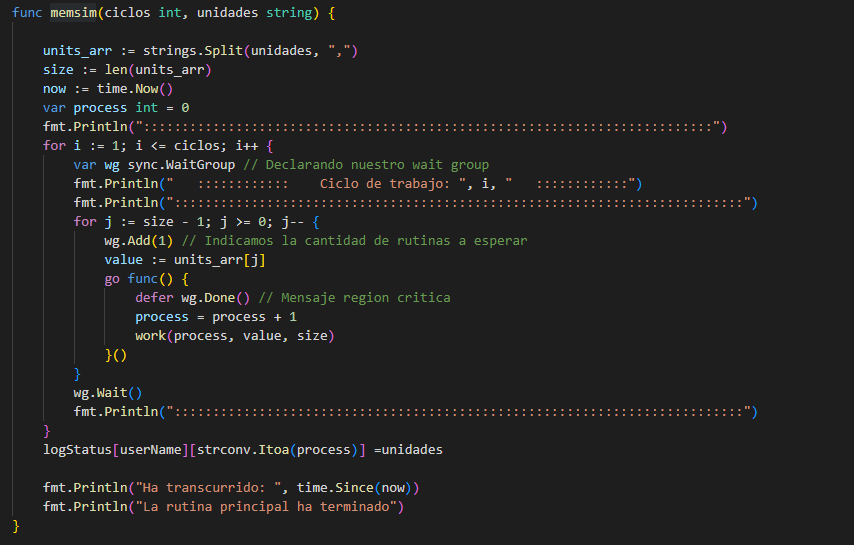
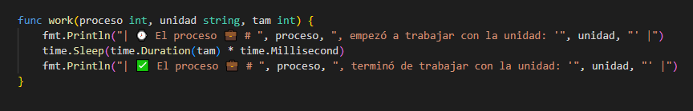
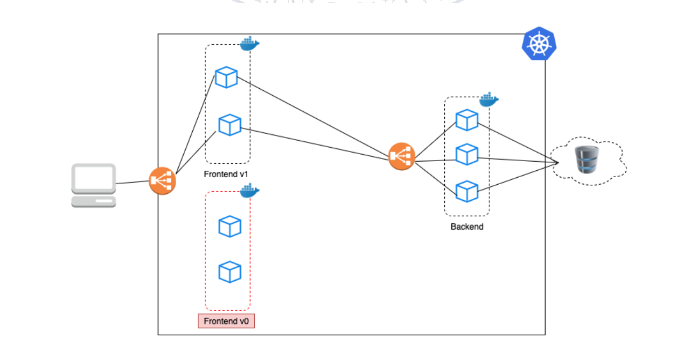
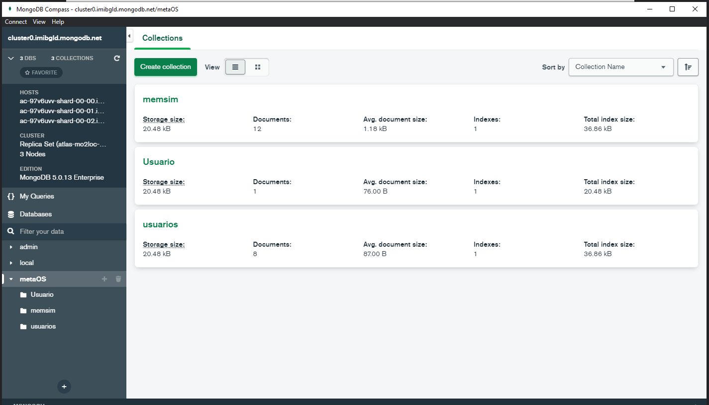
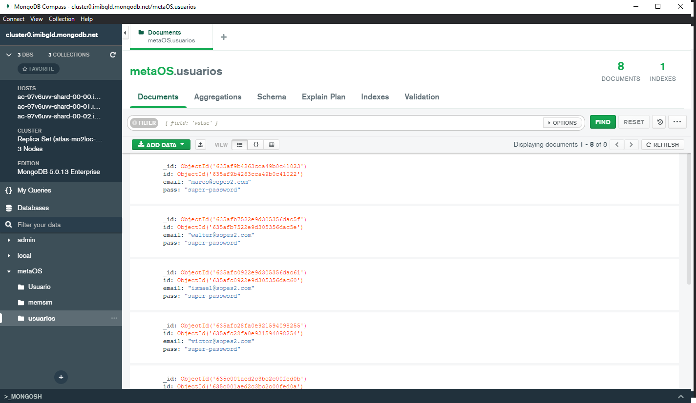
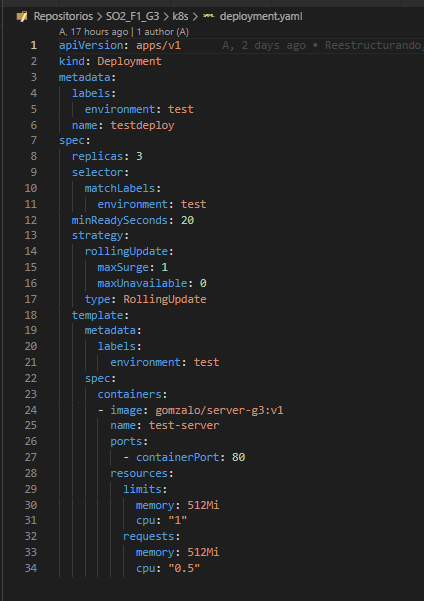
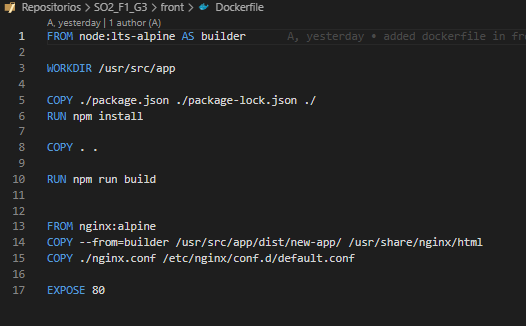

# **Manual técnico**

- [**Manual técnico**](#manual-técnico)
- [Fase 1](#fase-1)
  - [Requisitos del sistema](#requisitos-del-sistema)
  - [Instalar GO](#instalar-go)
    - [Descargar Go](#descargar-go)
    - [Configurar Variable de entorno](#configurar-variable-de-entorno)
    - [Configurar entorno Go](#configurar-entorno-go)
    - [Compilar archivo Go](#compilar-archivo-go)
  - [Instalar GCC](#instalar-gcc)
    - [Instalar cabeceras linux](#instalar-cabeceras-linux)
    - [Instalar dependencias](#instalar-dependencias)
  - [Kernel](#kernel)
- [Fase 2](#fase-2)
- [Fase 3](#fase-3)
- [Fase 4](#fase-4)

# Fase 1

## Requisitos del sistema

- Sistema GNU/Linux
- 1 Gb o más de RAM
- 10 Gb o más de Almacenamiento
- Compilador GCC instalado
- Compilador GoLang instalado
- Headers genericos del Kernel de Linux

## Instalar GO

### Descargar Go

Acceder al servidor

```sh
ssh usuario@server_ip
```

Moverse a la carpeta de usuario

```sh
cd ~
```

Descargar los archivos necesarios para compilar Go

```sh
curl -OL https://golang.org/dl/go1.19.linux-amd64.tar.gz
```

Validar el archivo descargado


```sh
sha256sum go1.16.7.linux-amd64.tar.gz
```

Descomprimir el archivo descargado y copiarlo a la carpeta `/usr/local`

```sh
sudo tar -C /usr/local -xvf go1.16.7.linux-amd64.tar.gz
```

### Configurar Variable de entorno

Con el editor de preferencia, abrir el archivo `profile` y agregar la ruta de los binarios de go

```sh
sudo nano ~/.profile
```

```sh
export PATH=$PATH:/usr/local/go/bin
```

### Configurar entorno Go

Crear un archivo mod para importar paquetes instalados

```sh
go mod init proyecto
```

### Compilar archivo Go

```sh
go build .
```

## Instalar GCC

### Instalar cabeceras linux

```sh
sudo apt install linux-headers-$(uname -r)
```

### Instalar dependencias

```sh
sudo apt install build-essential
```

## Kernel

Compilar kernel de archivo `.c`

```sh
make
```

Instalar módulo Kernel

```sh
sudo insmod [nombreModulo].ko
```

Mostrar mensajes de consola al instalar el módulo Kernel

```sh
sudo dmesg
```

Desinstalar módulo Kernel

```sh
sudo rmmod [nombreModulo]
```

Revisar archivos escrito desde Kernel instalado

```sh
cat /proc/[nombreModulo]
```

# Fase 2

## Implementacion de SYSCALL - Strace



## Reportes 



## Actualizacion de Consola


# Fase 3

## Implementacion de MEMSIM


## Funcion MEMSIM



## Tiempo e Impresion


# Fase 4

## Arquitectura


## Base de Datos MongoDB - NOSQL


## Usuarios


## memsim


## Despliegue


## Despliegue


## Dockerfile


[Documentación de APIRest](https://documenter.getpostman.com/view/5658161/2s84LGYaxu)