# **Manual de usuario**

- [**Manual de usuario**](#manual-de-usuario)
- [Fase 1](#fase-1)
  - [Menu Principal Meta OS System](#menu-principal-meta-os-system)
  - [Ingresar Datos](#ingresar-datos)
  - [Menu Opciones](#menu-opciones)
  - [Ingreso de Datos](#ingreso-de-datos)
  - [Resultados IOTOP](#resultados-iotop)
  - [Resultados TOP](#resultados-top)
- [Fase 2](#fase-2)
  - [SYSCALL](#syscall)
  - [Reporte JSON](#reporte-json)
- [Fase 3](#fase-3)

# Fase 1

## Menu Principal Meta OS System

En este apartado puedes seleccionar cada una de las caracteristicas necesarias a utilizar durante esta fase.

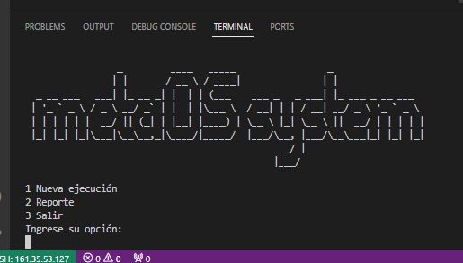
## Ingresar Datos
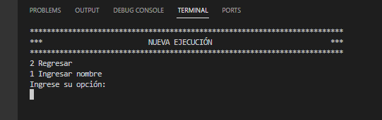
## Menu Opciones
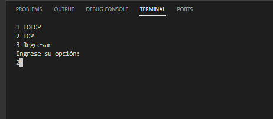
## Ingreso de Datos
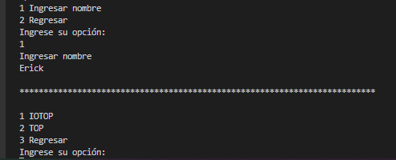
## Resultados IOTOP
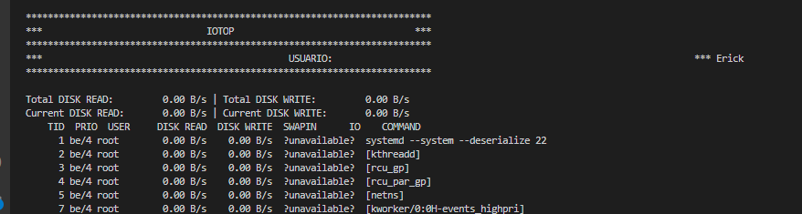
## Resultados TOP
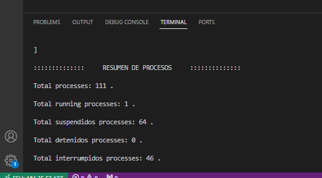

# Fase 2

## SYSCALL

1. Ingresar a la aplicación y elegir la opción *1. Nueva ejecución*, luego ingresar a la opción *3. STRACE* y seleccionar la opción *1. Ingresar nombre*.
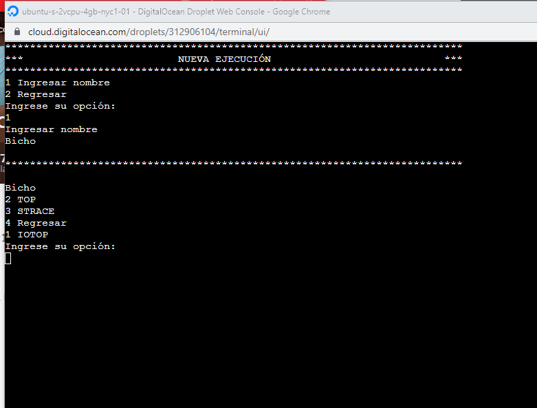

2. Ingresar un comando, como 
   ```sh
   echo hello
   ```
   y el sistema debera de mostrar los procesos que se ejecutan en el sistema.
   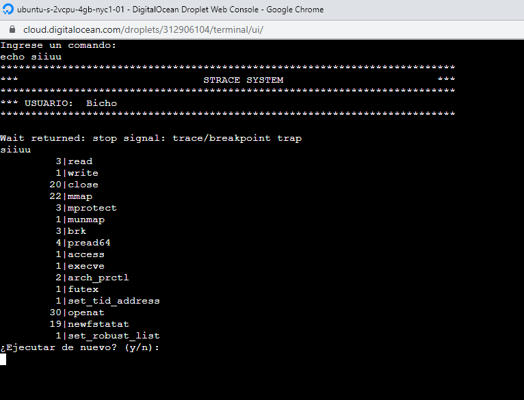

## Reporte JSON

1. Ingresar a la aplicación y elegir la opción *2. Reporte*.
   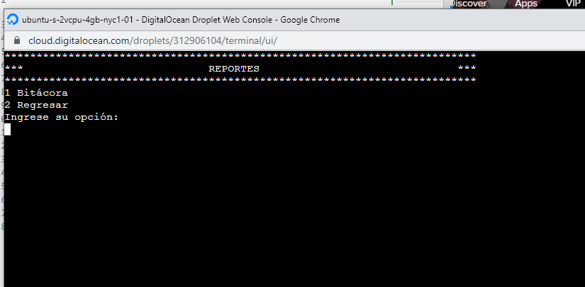
2. Seleccionar la opción *1. Bitácora*; el sistema debera de indicar que se genero el reporte.
   
3. Para visualizar el reporte, nos salimos de la aplicación y nos dirigimos a la carpeta del proyecto, se ingresa el comando:
   ```sh
   cat bitacora.json
   ```
   siendo *bitacora.json* el nombre del archivo que se genero.
   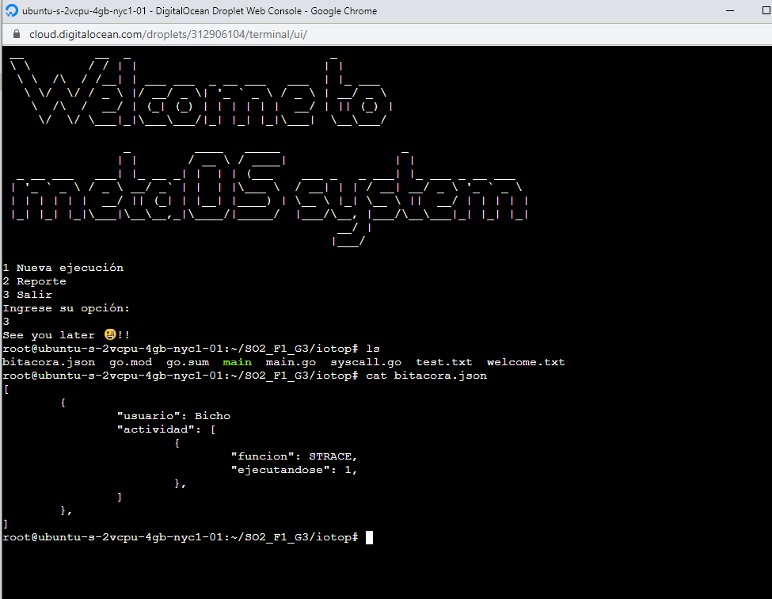


# Fase 3

## Funcion MEMSIM

1. Despues de colocar el nombre se debe seleccionar la opcion *4. MEMSIM*.
   [Menu Reporte](img/F3/opMemsim.png)
2. Se solicitaran dos parametros, el primero hace referencia a la cantidad de ciclos que se ejecutara el proceso        mientras que el segundo parametro es una lista en la que cada unidad esta delimitada por comas.
   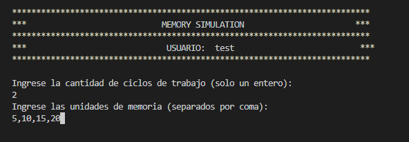
3. Se presentara el detalle de como fueron operados los procesos, su orden de inicio y en que momento terminaron
   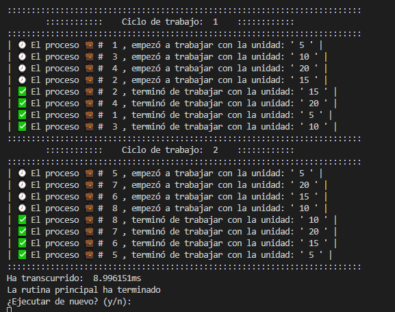
