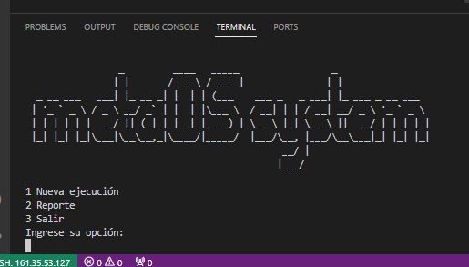
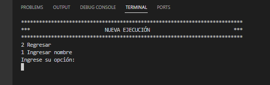
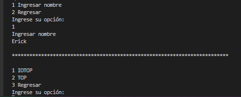
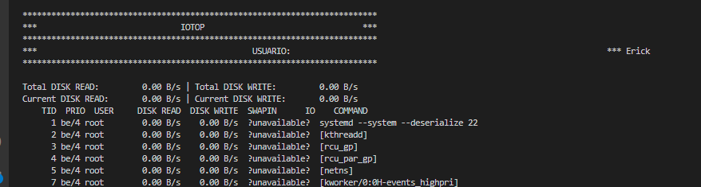
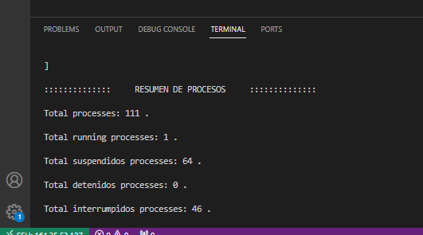

# **Manual de usuario**

- [**Manual de usuario**](#manual-de-usuario)
- [Fase 1](#fase-1)
- [Fase 2](#fase-2)
  - [SYSCALL](#syscall)

# Fase 1

# Fase 2

## SYSCALL

Ingresar a la aplicación y elegir la opción *Nueva ejecución*.

## Menu Principal GO
En este apartado puedes seleccionar cad auna de las Caracteristicas necesarias a utilizar durante esta fase

## Ingresar Datos

## Menu Opciones

## Ingreso de Datos

## Resultados IOTOP

## Resultados TOP
